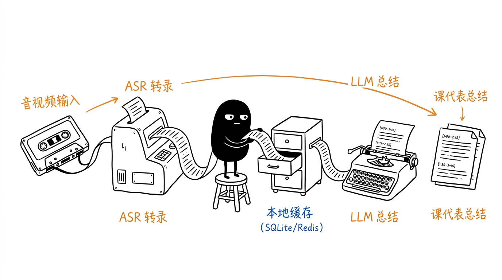
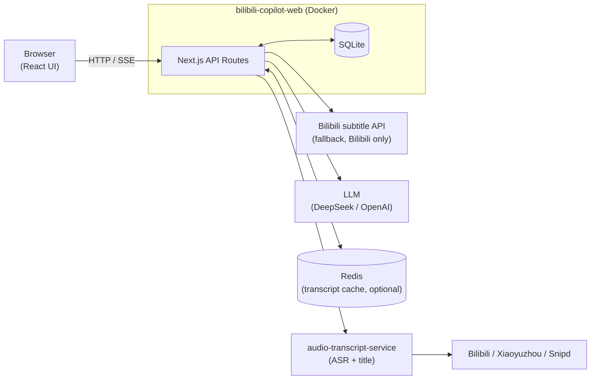

# AI 音视频课代表

A self-hosted tool that turns a **Bilibili video**, **Xiaoyuzhou (小宇宙)** podcast episode, or **Snipd** episode into a structured summary using an AI model (DeepSeek or any OpenAI-compatible API). It transcribes the audio (via the companion `audio-transcript-service`), then generates the summary. Supports multi-turn follow-up Q&A, session history, and clickable timestamps.

---

## System Architecture


*(Architecture illustration generated in [Ian Xiaohei style](https://github.com/helloianneo/ian-xiaohei-illustrations/tree/main))*



---

## Component Overviews

### 1. Browser UI

* **HomeClient (`components/HomeClient.tsx`)**: Main page — accepts a Bilibili URL (full link, BV ID, or b23.tv short link), a Xiaoyuzhou episode URL, or a Snipd episode URL, lets the user pick a summary mode, and fires `POST /api/summarize`. Consumes the SSE stream and hands the result to SummaryViewer + VideoChat. URL validation lives in `lib/source.ts` (`detectSource`).
* **SummaryViewer (`components/SummaryViewer.tsx`)**: Renders the AI-generated markdown summary. Converts `[MM:SS]` timestamp markers into clickable links — for Bilibili they jump to the exact moment in the player; for podcasts they open the episode page (podcast sites ignore the `?t=` param). Sanitizes output with DOMPurify.
* **VideoChat (`components/VideoChat.tsx`)**: Multi-turn Q&A interface grounded in the video's subtitles. Each message calls `POST /api/sessions/[id]/messages` and streams the response back.
* **SessionHistory (`components/SessionHistory.tsx`)**: Lists past sessions stored by device ID. Clicking a session restores the full summary and chat context.

### 2. Next.js API Layer

* **`/api/summarize`**: Core endpoint. Detects the source (`lib/source.ts`), resolves short URLs, then transcribes via `audio-transcript-service` (the primary path for all sources; transcripts cached in Upstash Redis as `{ text, title }` keyed by `<source>:asr:<id>`). For **Bilibili only**, it fetches the real video title separately and falls back to the official subtitle track if ASR fails; **podcasts** use the title the ASR service returns and surface the ASR error directly if it fails. Streams a structured summary from the LLM as SSE, emitting `PROGRESS:` events during long-running steps.
* **`/api/chat`**: Stateless chat endpoint used internally. Injects full subtitle text as system context and streams the LLM response.
* **`/api/sessions`**: CRUD for session records. Persists video metadata, conversation type, subtitle text, and message history in SQLite. Auto-cleans sessions older than `CHAT_HISTORY_SQLITE_TTL_DAYS` days on each write.

### 3. Data Layer

SQLite database at `./data/chat.db` (Docker volume at `/data/chat.db`).

| Table | Key columns |
|-------|-------------|
| `sessions` | `session_id` (UUID PK), `device_id`, `video_id`, `video_title`, `conversation_type`, `subtitle_text`, `source_url`, `created_at`, `last_accessed_at` |
| `messages` | `id` (PK), `session_id` (FK), `role`, `content`, `created_at` |

Indexes on `messages(session_id, created_at)` and `sessions(device_id, last_accessed_at)`.

### 4. External Integrations

* **audio-transcript-service**: Companion microservice that downloads audio from Bilibili / Xiaoyuzhou / Snipd and transcribes it via Gemini ASR, returning both the transcript and the real episode/video **title** in its `done` event. The primary transcription path for every source; **required for podcasts**, optional for Bilibili (which can fall back to subtitles). Source detection and any provider API keys (e.g. `SNIPD_API_KEY`) live in the service, not here. Reached at `AUDIO_TRANSCRIBE_SERVICE_URL`.
* **Bilibili APIs**: Used for the Bilibili-only subtitle fallback and to fetch the Bilibili video title. `BILIBILI_SESSION_TOKEN` (the `SESSDATA` cookie) is required for restricted or high-definition content.
* **DeepSeek / OpenAI-compatible LLM**: Generates summaries and answers follow-up questions. Configurable via `DEEPSEEK_*` or `OPENAI_COMPATIBLE_*` env vars.
* **Upstash Redis** *(optional)*: Caches transcripts as `{ text, title }` keyed by `<source>:asr:<id>` (and Bilibili subtitles), with a 7-day TTL. Skipped entirely when credentials are absent.

---

## Features

- Paste a **Bilibili** URL (full link, bare BV ID, or `b23.tv` short link), a **Xiaoyuzhou** episode URL, or a **Snipd** episode URL
- Real episode/video titles for every source (resolved by `audio-transcript-service`)
- Four summary modes: detailed outline, brief outline, summary, Q&A questions
- Clickable timestamps — jump to the moment in Bilibili; open the episode for podcasts
- Multi-turn chat grounded in the actual transcript
- Session history persisted in SQLite — sessions survive server restarts
- Transcript caching via Upstash Redis (7-day TTL; optional)
- Bilibili-only fallback to the official subtitle track if ASR is unavailable
- Real-time progress events during audio download and transcription

---

## Self-hosting

### Prerequisites

- Docker + Docker Compose
- A DeepSeek API key (or any OpenAI-compatible endpoint)
- [audio-transcript-service](https://github.com/YANGZ001/audio-trainscript-service) — required for podcasts (Xiaoyuzhou/Snipd) and the primary path for Bilibili; optional only if you use Bilibili exclusively and rely on its subtitle fallback
- _(Optional)_ Upstash Redis for transcript caching
- _(Optional)_ Bilibili `SESSDATA` cookie for restricted videos

### 1. Configure environment

```bash
cp .env.example .env.local
```

Edit `.env.local` — see the [Environment Variables](#environment-variables) section for the full reference.

### 2. Run

```bash
docker compose up --build
```

Open [http://localhost:3000](http://localhost:3000).

Session data is stored in `./data/chat.db` and persisted via a Docker volume.

---

## Environment Variables

### Required — LLM

| Variable | Default | Description |
|----------|---------|-------------|
| `DEEPSEEK_API_KEY` | — | API key for DeepSeek (or OpenAI-compatible provider) |
| `DEEPSEEK_API_URL` | `https://api.deepseek.com` | Base URL for the LLM API |
| `DEEPSEEK_MODEL` | `deepseek-chat` | Model name to use |

### Optional — OpenAI-compatible fallback

| Variable | Description |
|----------|-------------|
| `OPENAI_COMPATIBLE_API_KEY` | Alternative API key |
| `OPENAI_COMPATIBLE_BASE_URL` | Alternative base URL |
| `OPENAI_COMPATIBLE_MODEL` | Alternative model name |

### Optional — Bilibili

| Variable | Description |
|----------|-------------|
| `BILIBILI_SESSION_TOKEN` | Value of the `SESSDATA` cookie from bilibili.com — required for restricted or HD videos |

### Optional — Transcript Cache (Upstash Redis)

| Variable | Default | Description |
|----------|---------|-------------|
| `UPSTASH_REDIS_REST_URL` | — | Upstash Redis REST endpoint |
| `UPSTASH_REDIS_REST_TOKEN` | — | Upstash Redis REST token |
| `SUBTITLE_REDIS_CACHE_TTL_SECONDS` | `604800` (7 days) | Transcript/subtitle cache TTL in seconds |

### Audio Transcription (required for podcasts)

| Variable | Description |
|----------|-------------|
| `AUDIO_TRANSCRIBE_SERVICE_URL` | Base URL of `audio-transcript-service` (e.g. `http://hostname:3001`). Required for Xiaoyuzhou/Snipd and the primary path for Bilibili; provider keys like `SNIPD_API_KEY` are configured on the service, not here. |

### Optional — Database

| Variable | Default | Description |
|----------|---------|-------------|
| `DB_PATH` | `./data/chat.db` | Path to the SQLite database file |
| `CHAT_HISTORY_SQLITE_TTL_DAYS` | `90` | Sessions older than this are automatically deleted |

---

## API Reference

| Method | Path | Description |
|--------|------|-------------|
| `POST` | `/api/summarize` | Fetch subtitles + generate summary; returns SSE stream |
| `POST` | `/api/chat` | Stateless LLM chat with subtitle context; returns SSE stream |
| `POST` | `/api/sessions` | Create a new session |
| `GET` | `/api/sessions?device_id=<id>` | List sessions for a device |
| `GET` | `/api/sessions/[id]` | Get session details including full message history |
| `POST` | `/api/sessions/[id]/messages` | Append user message and stream AI reply |
| `PUT` | `/api/sessions/[id]/messages` | Replace entire message history for a session |

---

## Stack

| Layer | Technology |
|-------|-----------|
| Framework | Next.js (App Router) |
| Language | TypeScript |
| Frontend | React 19 |
| Styling | Tailwind CSS 4 |
| Markdown | marked + DOMPurify |
| Database | SQLite (`better-sqlite3`) |
| Cache | Upstash Redis (optional) |
| Deploy | Docker + docker-compose |
