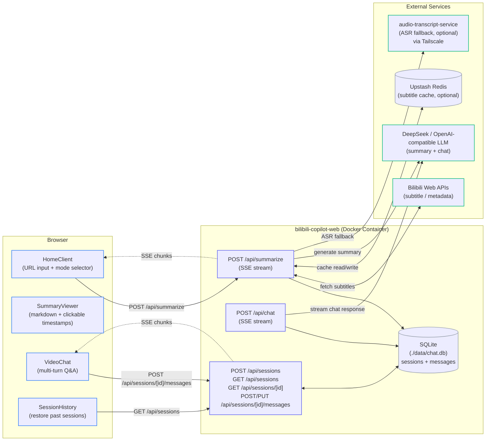

# B站 AI 视频课代表

A self-hosted tool that fetches Bilibili video subtitles and uses an AI model (DeepSeek or any OpenAI-compatible API) to generate structured summaries. Supports multi-turn follow-up Q&A, session history, and clickable timestamps.

---

## System Architecture

The following diagram maps the components, network boundaries, and execution paths of the service.

### Architecture Diagram

GitHub renders this Mermaid flowchart natively:



---

## Component Overviews

### 1. Browser UI

* **HomeClient (`components/HomeClient.tsx`)**: Main page — accepts any Bilibili URL (full link, BV ID, or b23.tv short link), lets the user pick a summary mode, and fires `POST /api/summarize`. Consumes the SSE stream and hands the result to SummaryViewer + VideoChat.
* **SummaryViewer (`components/SummaryViewer.tsx`)**: Renders the AI-generated markdown summary. Converts `[MM:SS]` timestamp markers into clickable links that jump to the exact moment in the embedded Bilibili player. Sanitizes output with DOMPurify.
* **VideoChat (`components/VideoChat.tsx`)**: Multi-turn Q&A interface grounded in the video's subtitles. Each message calls `POST /api/sessions/[id]/messages` and streams the response back.
* **SessionHistory (`components/SessionHistory.tsx`)**: Lists past sessions stored by device ID. Clicking a session restores the full summary and chat context.

### 2. Next.js API Layer

* **`/api/summarize`**: Core endpoint. Resolves short URLs, fetches Bilibili subtitles (with optional Upstash Redis caching), falls back to `audio-transcript-service` ASR if no subtitle track exists, then streams a structured summary from the LLM as SSE. Emits `PROGRESS:` events during long-running steps.
* **`/api/chat`**: Stateless chat endpoint used internally. Injects full subtitle text as system context and streams the LLM response.
* **`/api/sessions`**: CRUD for session records. Persists video metadata, conversation type, subtitle text, and message history in SQLite. Auto-cleans sessions older than `CHAT_HISTORY_SQLITE_TTL_DAYS` days on each write.

### 3. Data Layer

SQLite database at `./data/chat.db` (Docker volume at `/data/chat.db`).

| Table | Key columns |
|-------|-------------|
| `sessions` | `session_id` (UUID PK), `device_id`, `video_id`, `video_title`, `conversation_type`, `subtitle_text`, `created_at`, `last_accessed_at` |
| `messages` | `id` (PK), `session_id` (FK), `role`, `content`, `created_at` |

Indexes on `messages(session_id, created_at)` and `sessions(device_id, last_accessed_at)`.

### 4. External Integrations

* **Bilibili APIs**: Fetches video metadata and subtitle tracks. `BILIBILI_SESSION_TOKEN` (the `SESSDATA` cookie) is required for restricted or high-definition content.
* **DeepSeek / OpenAI-compatible LLM**: Generates summaries and answers follow-up questions. Configurable via `DEEPSEEK_*` or `OPENAI_COMPATIBLE_*` env vars.
* **Upstash Redis** *(optional)*: Caches raw subtitle text keyed by video ID with a configurable TTL (default 7 days). Skipped entirely when credentials are absent.
* **audio-transcript-service** *(optional)*: A companion microservice that downloads Bilibili audio and transcribes it via Gemini ASR. Used when a video has no official subtitle track. Reached over Tailscale MagicDNS at `AUDIO_TRANSCRIBE_SERVICE_URL`.

---

## Features

- Paste any Bilibili URL — full link (`https://www.bilibili.com/video/BVxxxx`), bare BV ID, or `b23.tv` short link
- Four summary modes: detailed outline, brief outline, summary, Q&A questions
- Clickable timestamps in the summary that jump to the exact moment in the video
- Multi-turn chat grounded in the video's actual subtitles
- Session history persisted in SQLite — sessions survive server restarts
- Subtitle caching via Upstash Redis (7-day TTL; optional)
- Optional audio transcription fallback via `audio-transcript-service` when no subtitle track exists
- Real-time progress events during subtitle download and transcription

---

## Self-hosting

### Prerequisites

- Docker + Docker Compose
- A DeepSeek API key (or any OpenAI-compatible endpoint)
- _(Optional)_ Upstash Redis for subtitle caching
- _(Optional)_ Bilibili `SESSDATA` cookie for restricted videos
- _(Optional)_ [audio-transcript-service](https://github.com/YANGZ001/audio-trainscript-service) for ASR fallback

### 1. Configure environment

```bash
cp .env.example .env.local
```

Edit `.env.local` — see the [Environment Variables](#environment-variables) section for the full reference.

### 2. Run

```bash
docker compose up --build
```

Open [http://localhost:3000](http://localhost:3000).

Session data is stored in `./data/chat.db` and persisted via a Docker volume.

---

## Environment Variables

### Required — LLM

| Variable | Default | Description |
|----------|---------|-------------|
| `DEEPSEEK_API_KEY` | — | API key for DeepSeek (or OpenAI-compatible provider) |
| `DEEPSEEK_API_URL` | `https://api.deepseek.com` | Base URL for the LLM API |
| `DEEPSEEK_MODEL` | `deepseek-chat` | Model name to use |

### Optional — OpenAI-compatible fallback

| Variable | Description |
|----------|-------------|
| `OPENAI_COMPATIBLE_API_KEY` | Alternative API key |
| `OPENAI_COMPATIBLE_BASE_URL` | Alternative base URL |
| `OPENAI_COMPATIBLE_MODEL` | Alternative model name |

### Optional — Bilibili

| Variable | Description |
|----------|-------------|
| `BILIBILI_SESSION_TOKEN` | Value of the `SESSDATA` cookie from bilibili.com — required for restricted or HD videos |

### Optional — Subtitle Cache (Upstash Redis)

| Variable | Default | Description |
|----------|---------|-------------|
| `UPSTASH_REDIS_REST_URL` | — | Upstash Redis REST endpoint |
| `UPSTASH_REDIS_REST_TOKEN` | — | Upstash Redis REST token |
| `SUBTITLE_REDIS_CACHE_TTL_SECONDS` | `604800` (7 days) | Subtitle cache TTL in seconds |

### Optional — Audio Transcription

| Variable | Description |
|----------|-------------|
| `AUDIO_TRANSCRIBE_SERVICE_URL` | Base URL of `audio-transcript-service` (e.g. `http://hostname:3001`) |

### Optional — Database

| Variable | Default | Description |
|----------|---------|-------------|
| `DB_PATH` | `./data/chat.db` | Path to the SQLite database file |
| `CHAT_HISTORY_SQLITE_TTL_DAYS` | `90` | Sessions older than this are automatically deleted |

---

## API Reference

| Method | Path | Description |
|--------|------|-------------|
| `POST` | `/api/summarize` | Fetch subtitles + generate summary; returns SSE stream |
| `POST` | `/api/chat` | Stateless LLM chat with subtitle context; returns SSE stream |
| `POST` | `/api/sessions` | Create a new session |
| `GET` | `/api/sessions?device_id=<id>` | List sessions for a device |
| `GET` | `/api/sessions/[id]` | Get session details including full message history |
| `POST` | `/api/sessions/[id]/messages` | Append user message and stream AI reply |
| `PUT` | `/api/sessions/[id]/messages` | Replace entire message history for a session |

---

## Stack

| Layer | Technology |
|-------|-----------|
| Framework | Next.js (App Router) |
| Language | TypeScript |
| Frontend | React 19 |
| Styling | Tailwind CSS 4 |
| Markdown | marked + DOMPurify |
| Database | SQLite (`better-sqlite3`) |
| Cache | Upstash Redis (optional) |
| Deploy | Docker + docker-compose |
